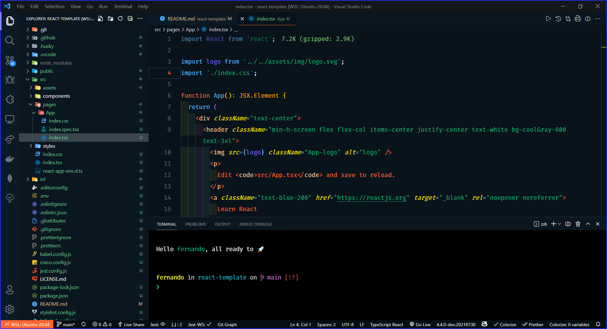

<h1 align="center">Template for Project ReactJs, Typescript, TailwindCSS and Jest</h1>

<p align="center">
  
</p>

<p align="center">
  

  

  

  
</p>
<br>

## 🧪 Tecnologias utilizadas

Para este projeto, foram utilizadas as seguintes tecnologias e recursos:

- [ReactJs](https://pt-br.reactjs.org/)
- [Typescript](https://www.typescriptlang.org/)
- [TailwindCSS](https://tailwindcss.com/)
- [Prettier](https://prettier.io/)
- [ESLint](https://eslint.org/)
- [Husky](https://typicode.github.io/husky/#/)
- [Jest](https://jestjs.io/pt-BR/)
- [React Testing Library](https://testing-library.com/)
- [Lint-Staged](https://github.com/okonet/lint-staged#readme)

## 🚀 Como executar

Passo 1: Faça a clonagem do projeto com o comando abaixo:

```bash
$ git clone https://github.com/fsclaro/react-template
```

Passo 2: Entre na pasta do projeto:

```bash
$ cd react-template
```

Passo 3: Inicie o projeto conforme os passos descritos abaixo:

```bash
# Instalar as dependências
$ yarn

# Iniciar o projeto
$ yarn start
```

O app estará disponível no seu browser pelo endereço http://localhost:3000.

## 💻 Projeto

Este template destina-se a permitir a criação inicial de projetos que utilizem ReactJS, Typescript, TailwindCSS e Jest.

## 📝 Licença

Esse projeto está sob a licença MIT. Veja o arquivo [LICENSE](LICENSE.md) para mais detalhes.

---

Feito com ❤️ by NandoSalles.
